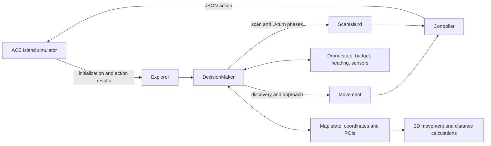
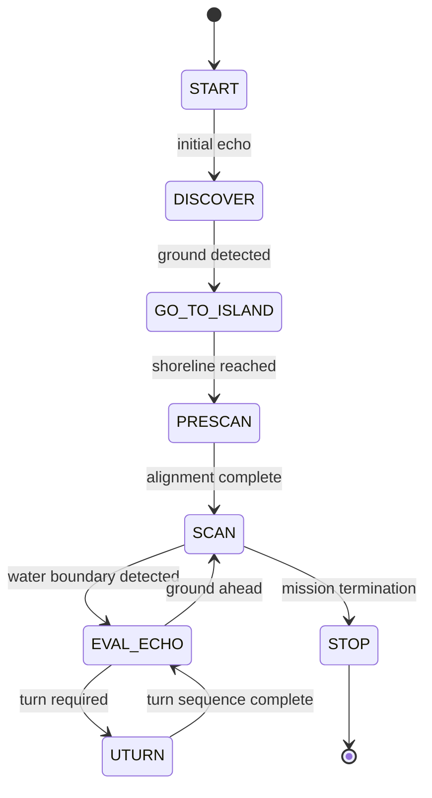

# Rescue Drone Controller

A simulation-based autonomous mission controller for the [ACE Island](https://ace-design.github.io/island/) serious game. The controller explores an unknown island, detects terrain and points of interest, tracks its position, and returns the creek closest to a detected emergency site.

This project was developed in Java 21 as part of McMaster University's SFWRENG 2AA4: Software Design I course.

## Project at a Glance

| Metric | Repository inventory |
|---|---:|
| Production Java types | 14 |
| Mission states | 8 |
| Internal command types | 9 |
| JUnit 5 test methods | 38 |
| Test classes | 9 |
| Assertion calls | 91 |
| Included simulation maps | 5 |

The test counts above are derived from the source tree. A continuous-integration workflow and published coverage report are planned but are not currently included.

## Mission Objectives

The controller is designed to:

1. Discover the island using directional echo commands.
2. Approach the detected shoreline while tracking position and heading.
3. Scan the island using an alternating traversal pattern.
4. Detect creeks and the emergency site from simulator feedback.
5. Record points of interest in a two-dimensional map.
6. Select the creek nearest the emergency site using Euclidean distance.
7. Stop safely when mission or resource constraints require termination.

## Architecture



### Main Components

- **`Explorer`** implements the simulator's `IExplorerRaid` interface and manages initialization, decisions, action acknowledgements, and the final mission report.
- **`DecisionMaker`** coordinates mission phases and delegates navigation decisions to the appropriate subsystem.
- **`Movement`** uses forward, left, and right echo data to discover and approach the island.
- **`ScanIsland`** alternates scanning and movement while executing left- and right-oriented U-turn sequences at island boundaries.
- **`Drone`** parses JSON feedback and maintains the current budget, heading, sensor range, biome, creek, and emergency-site state.
- **`Controller`** translates internal command values into API-compatible JSON actions.
- **`OnMap`** and **`Point`** track coordinates and points of interest and calculate the creek closest to the emergency site.
- **`Phase`** provides a common movement-decision interface for mission-phase implementations.

## Mission State Flow



The controller can also emit a stop command when its budget guard or a safety check prevents further movement.

## Command Model

Nine internal command values are mapped to five simulator actions:

| Internal command | Simulator action | Purpose |
|---|---|---|
| `FLY` | `fly` | Move forward |
| `ECHO_FWD`, `ECHO_L`, `ECHO_R` | `echo` | Measure terrain range in a selected direction |
| `SCAN` | `scan` | Detect biomes and points of interest |
| `TURN_L`, `TURN_R` | `heading` | Change the drone's heading |
| `STOP` | `stop` | End the mission |
| `STANDBY` | none | Internal no-action state |

## Navigation Strategy

### Island Discovery and Approach

The discovery phase gathers forward, left, and right echo readings. When ground is detected, the controller selects a heading and moves toward the island using the reported range.

### Island Scanning

Once the island is reached, the controller alternates `scan` and `fly` commands. When it detects a water boundary, it evaluates the forward range and either continues toward ground or begins a U-turn. Two nine-command U-turn sequences support alternating left and right traversal.

### Point-of-Interest Selection

The controller records detected creeks and the emergency site against its internally tracked coordinates. At the end of the mission, it calculates the Euclidean distance from each known creek to the emergency site and returns the closest creek identifier.

## Technology Stack

- Java 21
- Maven
- JUnit 5.10.1
- JSON-Java (`org.json`)
- Apache Log4j 2
- ACE Island Player and Runner 3.0

## Build and Run

### Prerequisites

- JDK 21
- Apache Maven

### Compile and test

```bash
mvn clean test
mvn package
```

### Run a simulation

```bash
mvn exec:java -q -Dexec.args="./maps/map03.json"
```

The repository includes five scenarios: `map03`, `map06`, `map10`, `map17`, and `map20`.

Each simulation writes artifacts to `outputs/`, including:

- `_pois.json`: detected points of interest
- `Explorer_Island.json`: command-and-response transcript
- `Explorer.svg`: explored map visualization

## Test Inventory

The repository declares 38 JUnit 5 test methods across nine test classes:

| Test class | Tests | Primary coverage |
|---|---:|---|
| `PointTest` | 10 | Coordinate initialization, four-direction movement, turns, conversion, and Euclidean distance |
| `MovementTest` | 7 | Ground detection, island approach, echo sequencing, and movement-state branches |
| `ConditionTest` | 6 | Finite-state transitions |
| `DroneTest` | 4 | Initialization, budget updates, sensor parsing, and water detection |
| `DirectionTest` | 4 | Direction conversion and rotation |
| `OnMapTest` | 4 | Map state, position updates, and empty-map reporting |
| `CommandsTest` | 1 | Command-to-action mappings |
| `DecisionMakerTest` | 1 | Initial decision behavior |
| `ScanIslandTest` | 1 | Prescan behavior when facing the island |

The suite currently focuses on unit-level behavior. End-to-end acceptance tests across the five maps, automated CI execution, and code-coverage reporting remain future work.

## Current Scope and Roadmap

- Add a Maven Wrapper and GitHub Actions workflow for reproducible builds.
- Expand direct coverage of `DecisionMaker`, `ScanIsland`, `Controller`, and `Explorer`.
- Add automated end-to-end tests for all included maps.
- Measure mission completion rate, nearest-creek accuracy, remaining budget, command count, terrain coverage, and runtime.
- Refactor coordinate keys into immutable value objects.
- Validate and document the battery-reserve policy.
- Add representative simulation outputs and benchmark results to this README.

## Academic Context and Attribution

This is a course-based simulation project built on the ACE Island framework. The repository retains framework conventions from the course starter, including the `teamXXX` package identifier. Project-specific functionality should not be presented as a physical-drone deployment.

Before reusing this repository for coursework, consult the applicable academic-integrity rules. The repository is distributed under the terms included in [`LICENSE.txt`](LICENSE.txt).
